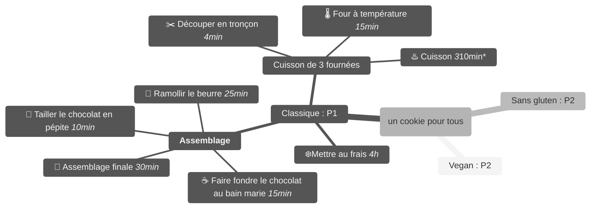

# Tp - GestionProjet
## Préparation
### Dupliquer le "repository"
**Github:** C'est une application web que l'on va utiliser pour stocker et travailler en équipe sur notre projet. Il s'utilise normalement avec Git que nous verrons en détail dans un prochain cours.
Dans ce TP, nous allons juste voir le strict minimum pour stocker nos schémas.
**Repository: ** Le dépôt en français, va contenir les fichiers e notre projet.

1. Pour chaque membre de l'équipe : si vous ne possédez pas déjà un compte Github, créer en un : [https://github.com/signup](https://github.com/signup).
2. Désignez une personne qui va créer le repository.
3. Connecter vous avec le compte de cette personne et cliquer sur "fork" (en haut à droite) pour dupliquer ce projet.
4. Laisser le choix par défaut et valider le "fork".
5. Voilà, vous avez dupliqué le projet dans votre espace. Maintenant, nous pouvons le modifier.😀

### Modifier le Readme
Nous allons modifier le fichier README.md qui est affiché quand on arrive que le repostiory. Pour cela :

1. Ouvrir le fichier en cliquant dessus
2. Cliquer sur le petit crayon en haut à droite
3. Un éditeur s'ouvre. L'extension "md", c'est pour Markdown, un langage qui permet de structurer un document. Jetez un œil à la documentation [https://docs.github.com/fr/get-started/writing-on-github/getting-started-with-writing-and-formatting-on-github/basic-writing-and-formatting-syntax](https://docs.github.com/fr/get-started/writing-on-github/getting-started-with-writing-and-formatting-on-github/basic-writing-and-formatting-syntax).
4. Modifiez le fichier puis appuyez sur "Commit changes..." (bouton vert en haut à droite)
5. Une boite de dialogue s'affiche avec la possibilité d'ajouter un "Commit messaage". Ce message est très important, il va permettre de faire comprendre aux autres membres de l'équipe pourquoi on a fait ce changement. Saisissez : "Tester la modification".
6. Vérifiez bien que l'option "Commit directly to the main branch" est séléctionné et validez.
7. Voilà votre première modification.😉

### Travailler à plusieurs
On va tenter de modifier le readme à partir du compte d'une autre personne.

1. Connectez-vous avec le compte **d'un autre** membre de l'équipe.
2. Allez sur le repository que vous venez de modifier.
3. Ouvrez le fichier README.md et cliquer sur le crayon.
```
😱 Il nous propose de faire un fork ?
En effet, par défaut dans Github, quand on modifie un projet sans avoir les droits dessus, il va le dupliquer pour qu'on puisse le modifier. Une fois les modifications faites, on peut créer une "pull request" pour proposer nos modification au repository de base. 
```
5. Ne validez pas le fork nous allons autoriser les membres de l'équipe à modifier le projet sans passer par le système de pull request.

### Ajouter les droits
1. Connectez-vous avec le compte qui a créé le repository.
2. Sur le repository, ouvrir l'onglet settings.
3. Puis dans Collaborateur, cliquer sur le bouton 'Add people"
4. Ajoutez les membres du projet sur le repository
5. Connecter vous sur les différents comptes des membres du projet pour valider l'invitation.
6. Retenter de modifier le README.md, ça devrait fonctionner.
7. Maintenant que tout le monde peut modifier ce fichier, que se passe-t-il si 2 personnes font une modification en même temps ? 🤪

### Modification en simultanée
1. Ouvrir 2 onglets sur le projet
2. Sur chaque onglet ouvrir le fichier en modification
3. Sur le 1er onglet, modifier le fichier et enregistrer celle-ci.
4. Sur le 2nd onglet, tenter de faire pareil et validez.
```
Un message d'erreur apparaît !
C'est une sécurité pour éviter de perdre le travail de l'autre. 
Dans un futur cours, on verra comment travailler en limitant ce genre de problèmes, mais pour l'instant, on va faire au plus simple !
```
5. Actualisez la page, la modification sur l'onglet 1 est apparu.
6. Modifiez à nouveau la page et validez, cette fois pas d'erreur.😊

Et voilà, maintenant que l'on a les bases, on va pouvoir attaquer les diagrammes ! 😎

## Diagrammes
Nous allons modifier les diagrammes vu en cours pour les appliquer au projet d'année. Pour cela, on va utiliser Mermaid, un outil intégré à Github qui va permettre de créer ces diagrammes sous forme textuelle.
Pour vous faciliter le travail, n'hésitez pas à utiliser l'éditeur en ligne : [https://mermaid.live/](https://mermaid.live/).
Pour ajouter des icônes : [https://emojiterra.com/fr/liste-emojis/](https://emojiterra.com/fr/liste-emojis/)

### Work Breakdown Structure
Créer la Work Breakdown Structure de votre projet. ([documentation](https://mermaid.js.org/syntax/mindmap.html)).
N'oubliez pas de préciser la priorité des besoins et une estimation de temps pour chaque tache.



### Gantt
Prenez l'une des branches de la Work Breakdown Structure et créer un diagramme de Gantt ([documentation](https://mermaid.js.org/syntax/gantt.html)).

```mermaid
gantt
    dateFormat HH:mm
    axisFormat %H:%M
    Initial milestone : milestone, m1, 17:49, 2m
    title Cookie classique


    section Assemblage
    🧈Ramollir le beurre :done, 10m
    ☕ Faire fondre le chocolat au bain marie :done, 15m
    🍫 Tailler le chocolat en pépite :done, 10m
    🍪 Assemblage finale :done, 30m


    section mettre au frais
    ❄️Mettre au frais :active, 3h


    section Cuisson
    🌡️ Four à température :15m
    ✂️ Découper en tronçon :4m
    ♨️ Cuisson :30m
```

```mermaid
gantt
    dateFormat HH:mm
    axisFormat %H:%M
    Initial milestone : milestone, m1, 17:49, 2m
    title Cookie classique


    section Assemblage
    🧈Ramollir le beurre :done, beurre, after m1, 10m
    ☕ Faire fondre le chocolat au bain marie :done, fondre, after m1, 15m
    🍫 Tailler le chocolat en pépite :done, choco, after m1, 10m
    🍪 Assemblage finale :done, assemblage, after beurre fondre choco, 30m


    section mettre au frais
    ❄️Mettre au frais :active, frais, after assemblage, 3h


    section Cuisson
    🌡️ Four à température :four, after frais, 15m
    ✂️ Découper en tronçon :cut, after frais, 4m
    ♨️ Cuisson :after four cut, 30m
```




N'oubliez pas de mettre à jour l'avancement durant votre projet 😉.

### Pert
Choisir une des branches de la Work Breakdown Structure (ça peut être la même) et créer un diagramme de PERT ([documentation](https://mermaid.js.org/syntax/flowchart.html)).

### Matrice des risques
Créer la matrice des risques de votre projet ainsi que les solutions que vous envisagez pour chacun d'eux ([documentation](https://mermaid.js.org/syntax/quadrantChart.html)).
